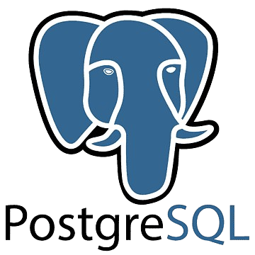
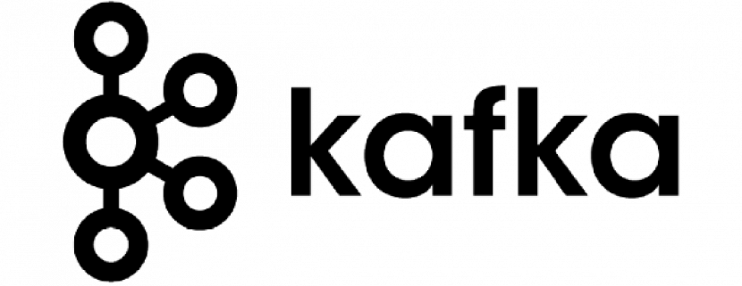

<span style="display: flex; align-items: center">
  <h1 style="margin: 0">Group Chat Project</h1>
  
</span>

<br />

<span style="display: flex; align-items: center">
  <h2 style="margin: 0">Data Base PostGreSQL</h2>
  
</span>

<p>
  PostGreSQL is an open source object oriented database. It is offering highly
  customizable that allows users to define their own data types , functions ,
  and good handling with complex and big data .
</p>

<span style="display: inline-flex; align-items: center">
  <h2 style="margin: 0">How the data will be stream in real time</h2>
  
</span>

<br />

<p>
  The project will use Kafka for real time streaming data pipelines and
  applications. A data pipeline that moves data from one system to another.
</p>

<h2 style="margin: 0">Another Technologies using in this Project</h2>
<ul>
  <li>
    Docker ⇢ is an open source platform that enables developers to manage
    containers .
  </li>
  <li>
    Containers ⇢ combine application source code with operating system ,
    libraries , and dependencies required to run code in any environment .
  </li>
  <li>
    Redis ⇢ is an open source noSQL key/value that used as an application cache
    or quick resposne database and store the data on memory . it helps deliver
    speed , reliability and performance .
  </li>
</ul>

<h2 style="margin: 0">Front Development</h2>
<span style="display: inline-flex; align-items: center">
  The frontend project will be in
  <p style="margin: 0 0 0 5px">Angular</p>
  
</span>
.
<p>
  The frontend project will be in Angular framework. Angular is a platform and
  framework for building single page client applications using html and
  typescript . In addition , the project will use primeflex and primeng for
  designing.
</p>

<h2 style="margin: 0">WorkSpace of the project : NX</h2>
<p>
  NX is a build system with built in tooling and advanced CI capabilities . it
  helps you maintain and scale monorepos , both locally and on CI. CI refers to
  the build and unit testing stages of the software release process .
</p>
✨

## Integrate with editors

Enhance your Nx experience by installing [Nx Console](https://nx.dev/nx-console) for your favorite editor. Nx Console
provides an interactive UI to view your projects, run tasks, generate code, and more! Available for VSCode, IntelliJ and
comes with a LSP for Vim users.

## Start the application

Run `npx nx serve danielProjectWorkspace` to start the development server. Happy coding!

## Build for production

Run `npx nx build danielProjectWorkspace` to build the application. The build artifacts are stored in the output directory (e.g. `dist/` or `build/`), ready to be deployed.

## Running tasks

To execute tasks with Nx use the following syntax:

```
npx nx <target> <project> <...options>
```

You can also run multiple targets:

```
npx nx run-many -t <target1> <target2>
```

..or add `-p` to filter specific projects

```
npx nx run-many -t <target1> <target2> -p <proj1> <proj2>
```

Targets can be defined in the `package.json` or `projects.json`. Learn more [in the docs](https://nx.dev/features/run-tasks).

## Set up CI!

Nx comes with local caching already built-in (check your `nx.json`). On CI you might want to go a step further.

- [Set up remote caching](https://nx.dev/features/share-your-cache)
- [Set up task distribution across multiple machines](https://nx.dev/nx-cloud/features/distribute-task-execution)
- [Learn more how to setup CI](https://nx.dev/recipes/ci)

## Explore the project graph

Run `npx nx graph` to show the graph of the workspace.
It will show tasks that you can run with Nx.

- [Learn more about Exploring the Project Graph](https://nx.dev/core-features/explore-graph)

## Connect with us!

- [Join the community](https://nx.dev/community)
- [Subscribe to the Nx Youtube Channel](https://www.youtube.com/@nxdevtools)
- [Follow us on Twitter](https://twitter.com/nxdevtools)
